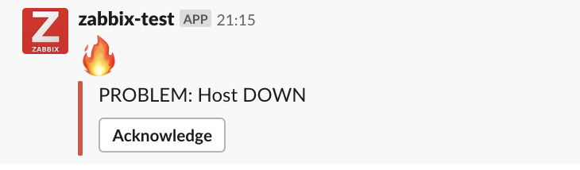
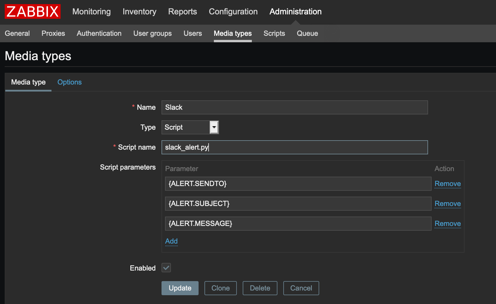
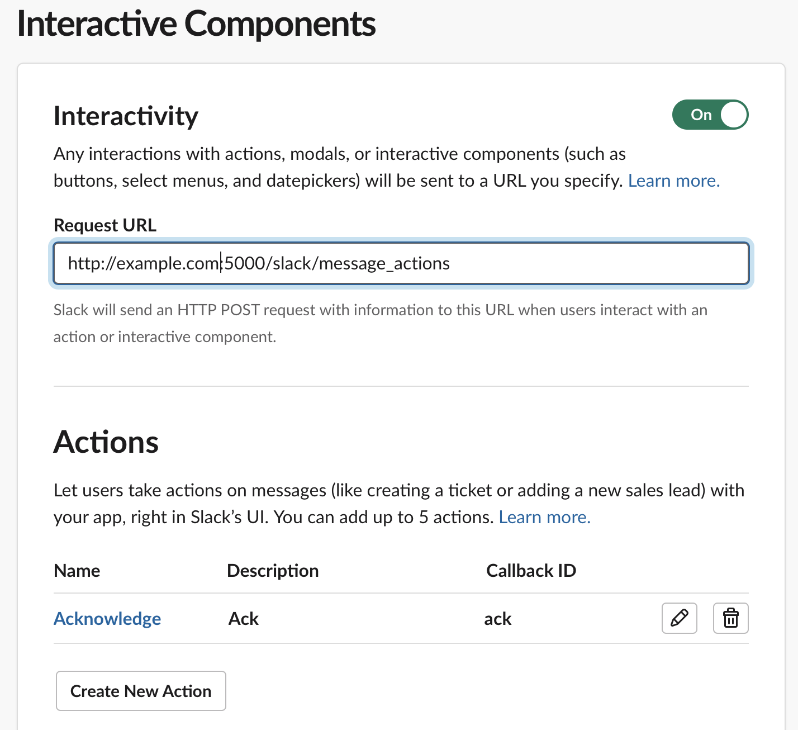

# Zabbix Send Alerts to Slack  

It's python script for send alerts to Slack [src/slack_alert.py](src/slack_alert.py)  
and flask app for handling [Slack Interactive Messages](https://api.slack.com/docs/message-buttons) in [slack_handler](slack_handler/)

At the moment there is only one button that allows you to confirm the event in Zabbix: 

Installation
------------

### The script for send message

This [`slack_alert.py`](src/slack_alert.py) script needs to be placed in the `AlertScriptsPath` directory that is specified within the Zabbix servers' configuration file (`zabbix_server.conf`) and must be executable by the user running the zabbix_server binary (usually "zabbix") on the Zabbix server:

    grep AlertScriptsPath /etc/zabbix/zabbix_server.conf
    ### Option: AlertScriptsPath
    AlertScriptsPath=/usr/local/share/zabbix/alertscripts

    ls -lah /usr/lib/zabbix/alertscripts/slack_alert.py
    -rwxr-xr-x 1 root root 2.0K Dec 21 18:51 /usr/lib/zabbix/alertscripts/slack_alert.py

You need to change SLACK_BOT_TOKEN in script to your real token  
And install [`requierements.txt`](src/requierements.txt)
    
    pip install -r requirements.txt

##### In zabbix "Administration -> Media types -> Create media type"

##### In zabbix Configuration -> Actions -> Create Action  
##### Operations  
|                 |              |
| --------------- |:-------------|
| Default subject | {EVENT.ID} |  
| Default message | {TRIGGER.STATUS}: {EVENT.NAME}: *{HOST.NAME1}* <https://z.crutches.space/zabbix/history.php?action=showgraph&itemids%5B%5D={ITEM.ID1}\|{ITEM.NAME1}>: *{ITEM.VALUE1}*   Event: <https://z.crutches.space/zabbix/tr_events.php?triggerid={TRIGGER.ID}&eventid={EVENT.ID}\|{EVENT.ID}> |  

##### Recovery operations
|                 |              |
| --------------- |:-------------|
| Default subject | {EVENT.ID} |  
| Default message | {TRIGGER.STATUS}: {EVENT.NAME}: *{HOST.NAME1}*   <https://z.crutches.space/zabbix/history.php?action=showgraph&itemids%5B%5D={ITEM.ID1}|{ITEM.NAME1}>: *{ITEM.LASTVALUE1}* |  

Its my example but you can change "Default message" as you want  
And you should not change subject, because {EVENT.ID} used in "Acknowledge" button  

After that zabbix will send notifications to Slack  

### The handler for work with Slack Interactive messages

SLACK_BOT_TOKEN and SLACK_VERIFICATION_TOKEN you need to get in Slack API [Create New App](https://api.slack.com/apps?new_app=1)

And you need create Interactive component In your Slack App with Callback ID: "ack" as you can see below

Run docker container on your host example.com:
    
    SLACK_BOT_TOKEN=xoxb-XXX SLACK_VERIFICATION_TOKEN=YYY ZABBIX_URL=https://examplle.com/zabbix/ ZABBIX_USER=slack-api ZABBIX_PASSWORD=PaSSw0rD docker run --rm -e SLACK_BOT_TOKEN -e SLACK_VERIFICATION_TOKEN -e ZABBIX_URL -e ZABBIX_USER -e ZABBIX_PASSWORD --name zabbix-slack -d -p 5000:5000 akiryliuk/zabbix-slack-handler:latest

